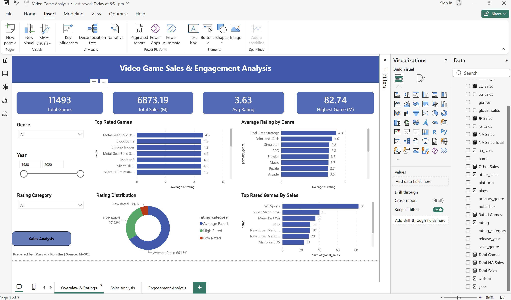
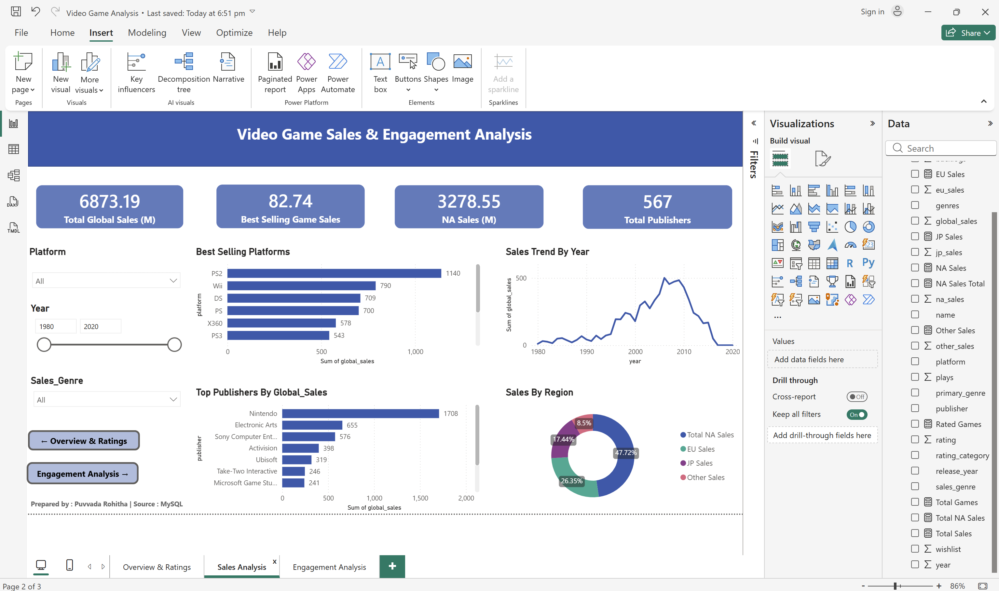
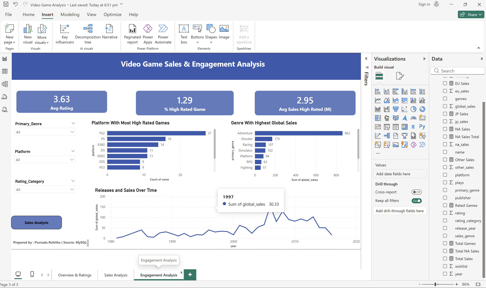

# 🎮 Video Game Sales & Engagement Analysis

## 📌 Project Overview
Analysis of 11,493 video game records to uncover global sales trends,
platform performance, publisher rankings, and engagement metrics
using MySQL and Power BI.

## 🛠️ Tools Used
- **MySQL** — Data cleaning, transformation, analysis (15+ queries)
- **Power BI** — 3-page interactive dashboard
- **Dataset** — vgsales_cleaned.csv + games_cleaned.csv

- ## 🧹 Data Cleaning Steps
- Fixed genres list format ['Action'] → Action
- Filled 938 missing plays with median
- Filled 451 missing backlogs with median
- Fixed 165 missing years in vgsales
- Rebuilt name_canon for better JOIN matching
- Added primary_genre column

## 📊 Dashboard Pages
### Page 1 — Overview & Ratings

### Page 2 — Sales Analysis

### Page 3 — Engagement Analysis

## 🔍 Key Insights
- **PS2** is the best-selling platform with **1,140M** global sales
- **Nintendo** leads publishers with **1,708M** total sales
- **North America** contributes **47.7%** of 6,869M global sales
- **Adventure** is the highest selling genre across all platforms
- Games rated **4.0+** have **2x higher** avg sales than low rated games

## 🗄️ SQL Concepts Used
- JOINs (LEFT JOIN, INNER JOIN)
- CTEs (WITH clause)
- Window Functions (RANK, ROW_NUMBER, LAG)
- Aggregations (SUM, AVG, COUNT)
- CASE WHEN statements
- Subqueries and Views

## 📁 Files
| File | Description |
|------|-------------|
| Video_Game_Analysis.sql | Complete SQL script |
| Screenshots/ | Dashboard page screenshots |

## 👩‍💻 Author
**Puvvada Rohitha**
Aspiring Data Analyst | SQL | Power BI | Python | Excel
📧 rohithapuvvada@gmail.com
🔗 [LinkedIn](https://www.linkedin.com/in/puvvadarohitha-0918a0388)
